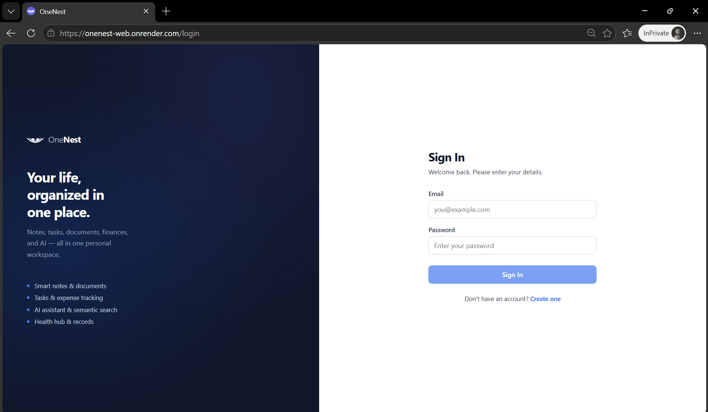
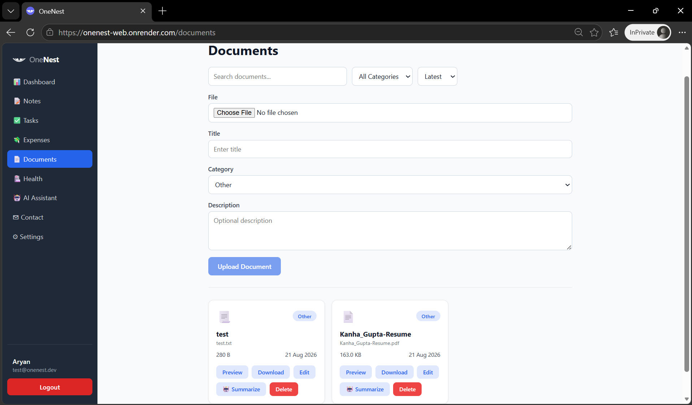
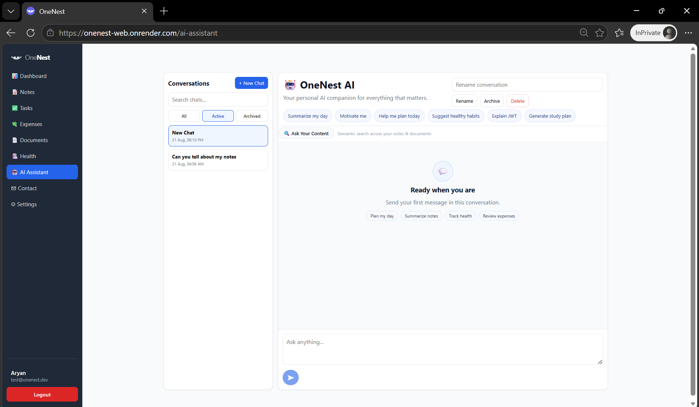
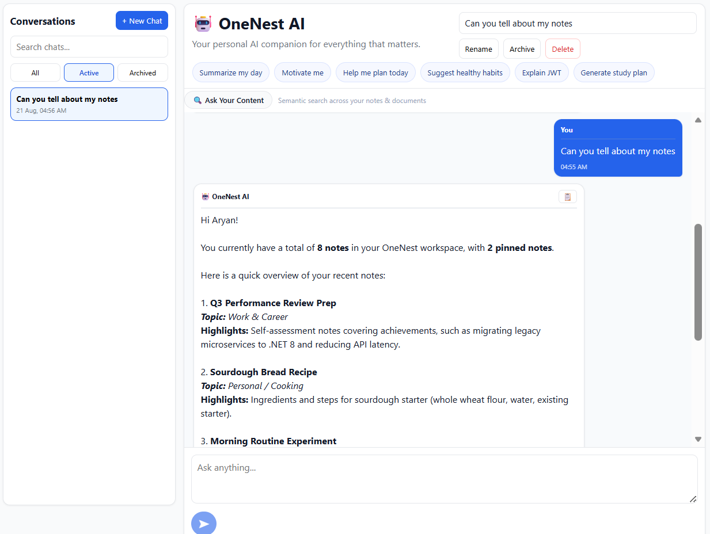

# OneNest AI

A personal life management app that brings notes, tasks, expenses, documents, health tracking, and an AI assistant all into one place.

Built with **Angular 22** (frontend), **ASP.NET Core .NET 10** (backend), and **PostgreSQL** with vector search.


---

## Screenshots

### Login


### Register


### Dashboard


### Notes


### Tasks


### Expenses


### Documents


### Health Hub


### AI Assistant


### Semantic Search


### Settings


### Admin Panel


---

## What it does

**Authentication** — Register, log in, change password, delete account. All routes are protected by JWT tokens. Tokens expire after 7 days.

**Notes** — Create, edit, delete, pin, archive, and search your notes. Notes are also indexed automatically for semantic search.

**Tasks** — Create tasks with a title, due date, and priority (Low / Medium / High). Mark them done, filter by status, and search.

**Expenses** — Log income and expenses with a category (Food, Travel, Bills, etc.). See totals and charts on the dashboard.

**Documents** — Upload files (PDF, Word, Excel, images, and more). The app extracts the text automatically on upload so the AI can read it. Supports preview, download, bulk ZIP download, and per-user storage quota (150 MB).

**Health Hub** — Track medicines (with food timing reminders), book appointments, keep a medical record (height, weight, BMI auto-calculated), and upload health reports.

**AI Assistant** — A chat interface powered by Google Gemini. The AI automatically pulls in your notes, tasks, expenses, health data, and documents so it can answer questions about your actual life, not just generic facts. Conversations are saved and can be archived.

**Semantic Search** — Ask a question in plain English (e.g. "notes about travel plans") and get the most relevant notes and documents back, ranked by meaning — not just keywords. Powered by a local ONNX embedding model (all-MiniLM-L6-v2).

**RAG (Ask your documents)** — Ask the AI a question and it will search your notes and documents for relevant chunks, then use those as context to give you a grounded answer with source citations.

**Settings** — Change display name, password, height/weight units (metric/imperial), AI response style, and delete your account.

**Admin Panel** — (Admin role only) View all users, change user roles, and manage contact/support messages. Admins cannot change their own role.

---

## Tech Stack

| Layer | What's used |
|---|---|
| Frontend | Angular 22, TypeScript, Angular Signals, Chart.js |
| Backend | ASP.NET Core .NET 10, Clean Architecture, EF Core |
| Database | PostgreSQL (Supabase), pgvector extension |
| AI Chat | Google Gemini (`gemini-2.5-flash`) |
| Embeddings | ONNX local model (`all-MiniLM-L6-v2`, 384-dim, ~22 MB, runs in-process) |
| File Storage | Supabase Storage (private S3 bucket) |
| Auth | JWT Bearer tokens |
| Deployment | Render (Docker for backend, static site for frontend) |

---

## Project Structure

```
OneNest-AI/
├── backend/
│   ├── OneNest.API           → controllers, middleware, Program.cs
│   ├── OneNest.Application   → service interfaces, DTOs
│   ├── OneNest.Domain        → entities, enums (no external deps)
│   └── OneNest.Infrastructure → EF Core, Gemini, ONNX, Supabase Storage
│
├── frontend/
│   └── OneNest.Web           → Angular app
│
├── assets/
│   └── screenshots/          → app screenshots for this README
│
├── docs/                     → deployment and architecture docs
├── database/                 → migration scripts
└── OneNest-Documentation/    → BRD and architecture diagrams (PDF)
```

---

## Running locally

### What you need

- .NET 10 SDK
- Node.js 20+
- PostgreSQL with the `pgvector` extension enabled
- A Google Gemini API key
- A Supabase project (for storage — optional for local dev if you swap the file storage implementation)

### 1. Clone

```bash
git clone https://github.com/Kanha412/OneNest-AI.git
cd OneNest-AI
```

### 2. Backend setup

Copy the example env file and fill in your values:

```bash
cp .env.example .env
# Edit .env — add your DB connection string, Gemini API key, JWT secret
```

Run the backend:

```bash
cd backend/OneNest.API
dotnet restore
dotnet ef database update --project ../OneNest.Infrastructure --startup-project .
dotnet run
```

Backend runs at: `https://localhost:5001`
Swagger UI: `https://localhost:5001/swagger`

### 3. Frontend setup

```bash
cd frontend/OneNest.Web
npm install
npm start
```

Frontend runs at: `http://localhost:4200`

---

## Environment variables

See `.env.example` at the root for the full list. Key ones:

| Variable | What it is |
|---|---|
| `ConnectionStrings__DefaultConnection` | PostgreSQL connection string |
| `Gemini__ApiKey` | Google Gemini API key |
| `Jwt__SecretKey` | JWT signing secret (min 32 chars) |
| `Supabase__Url` | Supabase project URL |
| `Supabase__ServiceRoleKey` | Supabase service-role key |
| `Cors__AllowedOrigins__0` | Frontend URL (for CORS) |

---

## How the AI works (quick summary)

When you send a message in the AI chat:

1. The **Workspace Orchestrator** decides which tools are relevant (Notes, Tasks, Expenses, Health, Documents).
2. It uses a combination of **Gemini Planner** (LLM-based) and **keyword matching** to pick tools.
3. Selected tools fetch your real data from the database.
4. That data is bundled into a context block and added to the system prompt.
5. **Gemini** generates a response that's grounded in your actual information.

For **RAG queries**, it also runs your question through the local ONNX model to find the most semantically similar chunks from your notes and documents, and uses those as additional context.

---

## Notes on the embedding model

The app uses a **local ONNX model** (`all-MiniLM-L6-v2` INT8 quantized, ~22 MB) for generating embeddings. It runs inside the Docker container — no API call, no cost, no rate limits. The model is downloaded and SHA256-verified during the Docker build.

---

## Documentation

Everything is documented. If you want to understand the product, APIs, database, or deployment — it's all here.

### 📋 Product & Architecture (PDF)

| Document | What it covers |
|---|---|
| [Business Requirements Document](OneNest-Documentation/BRD/OneNest-BRD-v1.0.pdf) | Full product spec — use cases, all 60+ functional requirements, non-functional requirements, API contract summary, traceability matrix, glossary |
| [Architecture & Flow Diagrams](OneNest-Documentation/BRD/OneNest-Architecture-Diagrams-v1.0.pdf) | 12 visual diagrams — system deployment, clean architecture, auth flow, RAG pipeline, semantic indexing, AI workspace, document upload, use case, data flow, routing, ER diagram, request lifecycle |

### 📁 Technical Docs (Markdown)

| File | What it covers |
|---|---|
| [docs/API.md](docs/API.md) | All REST endpoints, request/response shapes, status codes, DTO catalog |
| [docs/Database.md](docs/Database.md) | All 13 entities, schema, indexes, migration timeline |
| [docs/DEPLOYMENT.md](docs/DEPLOYMENT.md) | Step-by-step guide to deploy on Render (backend Docker + frontend static site) |
| [docs/Infrastructure.md](docs/Infrastructure.md) | Backend architecture, DI setup, AI integration, embedding design |
| [docs/UI.md](docs/UI.md) | Angular app structure, routing, guards, feature module behaviour |
| [docs/Roadmap.md](docs/Roadmap.md) | What's been built (phases 1–7) and what's planned next |
| [docs/Vision.md](docs/Vision.md) | Why OneNest exists, who it's for, guiding principles |

---

## What's built (phases completed)

- ✅ Auth (register, login, JWT, password change, account deletion)
- ✅ Notes, Tasks, Expenses, Documents, Health Hub
- ✅ Workspace-aware AI chat (Gemini + tool orchestration)
- ✅ AI document intelligence (text extraction + summarization)
- ✅ Semantic search with local ONNX embeddings + pgvector
- ✅ RAG pipeline (ask questions over your notes and documents)
- ✅ Admin panel (user management, contact message handling)
- ✅ Supabase Storage for files
- ✅ Production-ready Docker setup for Render deployment

---

## Developer

**Kanha Gupta**
<!-- Custom Software Engineering Analyst @ Accenture -->

- GitHub: [github.com/Kanha412](https://github.com/Kanha412)
- LinkedIn: [linkedin.com/in/kanhagupta412](https://linkedin.com/in/kanhagupta412)

---

MIT License
