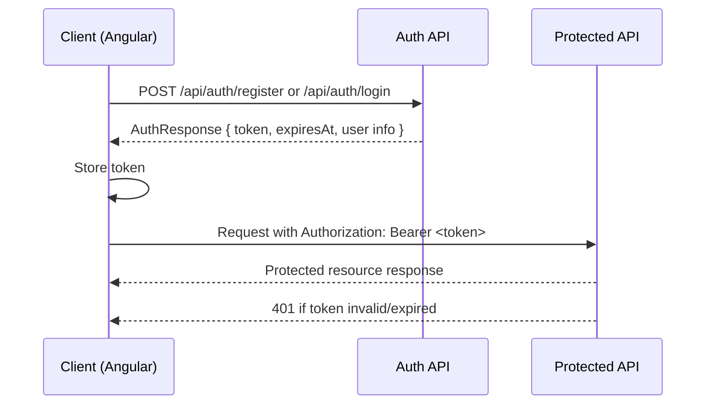

# OneNest AI API Reference

This document describes the current backend HTTP API implemented in `backend/OneNest.API`.

> Scope rule: this file documents only endpoints and contracts that currently exist in code.

## Overview

- **Framework:** ASP.NET Core Web API
- **Auth:** JWT Bearer (`Authorization: Bearer <token>`)
- **Default route pattern:** `api/[controller]` (except `health-hub`)
- **Interactive docs in development:** Swagger/OpenAPI is enabled in Development environment.

## Authentication Flow



### JWT Configuration (current behavior)

- Token validation enforces:
  - issuer
  - audience
  - lifetime
  - signature key
- Claims include:
  - `sub` (user id)
  - `nameidentifier` (user id)
  - `email`
  - `jti`

## Global Status Code Patterns

| Code | Meaning in OneNest API |
|---|---|
| `200 OK` | Successful read/write operation |
| `201 Created` | Resource created (used by selected endpoints) |
| `204 No Content` | Successful operation with no body (delete/toggle/archive; medical record empty) |
| `400 Bad Request` | Validation/domain rule failure (`InvalidOperationException`, `AuthException` mapping) |
| `401 Unauthorized` | Login failure, or missing/invalid bearer token |
| `404 Not Found` | Resource not found for current user |
| `409 Conflict` | Registration conflict (duplicate email) |
| `429 Too Many Requests` | AI rate-limit scenario (mapped from service exception text) |

---

## DTO Catalog

## Auth DTOs

### `RegisterRequest`

| Field | Type | Validation |
|---|---|---|
| `fullName` | string | required, length 2-100 |
| `email` | string | required, valid email |
| `password` | string | required, length 6-100 |

### `LoginRequest`

| Field | Type | Validation |
|---|---|---|
| `email` | string | required, valid email |
| `password` | string | required |

### `AuthResponse`

| Field | Type |
|---|---|
| `userId` | guid |
| `fullName` | string |
| `email` | string |
| `token` | string |
| `expiresAt` | datetime (UTC) |

### `ChangePasswordRequest`

| Field | Type | Validation |
|---|---|---|
| `currentPassword` | string | required |
| `newPassword` | string | required, length 6-100 |
| `confirmPassword` | string | required, must match `newPassword` |

### `DeleteAccountRequest`

| Field | Type | Validation |
|---|---|---|
| `password` | string | required |

## AI DTOs

### Requests

- `CreateConversationRequest`
  - `title?: string`
- `RenameConversationRequest`
  - `title: string` (required, max 120)
- `SendMessageRequest`
  - `message: string` (required, max 8000)
- `ChatRequest`
  - `message: string` (required, max 4000)

### Responses

#### `ConversationListResponse`

| Field | Type |
|---|---|
| `id` | guid |
| `title` | string |
| `lastMessageAt` | datetime |
| `createdAt` | datetime |
| `isArchived` | bool |

#### `ConversationResponse`

| Field | Type |
|---|---|
| `id` | guid |
| `title` | string |
| `createdAt` | datetime |
| `updatedAt` | datetime? |
| `lastMessageAt` | datetime |
| `isArchived` | bool |
| `messages` | `ChatMessageResponse[]` |

#### `ChatMessageResponse`

| Field | Type |
|---|---|
| `id` | guid |
| `role` | string (`user`/`assistant`) |
| `content` | string |
| `timestamp` | datetime |
| `isError` | bool |
| `usedWorkspaceData` | bool |
| `responseMode` | string |
| `workspaceToolsUsed` | string[] |

#### `ChatResponse`

| Field | Type |
|---|---|
| `response` | string |
| `model` | string |
| `timestamp` | datetime |
| `usedWorkspaceData` | bool |
| `responseMode` | string |
| `workspaceToolsUsed` | string[] |

## Notes DTOs

- `CreateNoteRequest`: `title`, `content`
- `UpdateNoteRequest`: `title`, `content`
- `NoteResponse`: `id`, `title`, `content`, `createdAt`, `updatedAt`, `isPinned`, `isArchived`

## Tasks DTOs

- `CreateTaskRequest` / `UpdateTaskRequest`
  - `title` (required, max 100)
  - `description` (required, max 1000)
  - `dueDate?: date`
  - `priority` (`1=Low`, `2=Medium`, `3=High`)
- `TaskResponse`
  - `id`, `title`, `description`, `dueDate`, `priority`, `isCompleted`, `createdAt`, `updatedAt`, `completedAt`

## Expenses DTOs

- `CreateExpenseRequest` / `UpdateExpenseRequest`
  - `title` (required, max 100)
  - `amount` (> 0)
  - `category` (enum)
  - `transactionType` (`1=Income`, `2=Expense`)
  - `date` (required)
  - `notes` (max 1000)
- `ExpenseResponse`
  - `id`, `title`, `amount`, `category`, `transactionType`, `date`, `notes`, `createdAt`, `updatedAt`
- `ExpenseSummaryResponse`
  - `totalIncome`, `totalExpense`, `currentBalance`, `thisMonthIncome`, `thisMonthExpense`, `topExpenseCategory`, `recentTransactions`, `categoryBreakdown`, `monthlyBreakdown`

## Documents DTOs

- `CreateDocumentRequest` / `UpdateDocumentRequest`
  - `title` (required, max 150)
  - `category` (`1=Resume,2=Certificate,3=Identity,4=Medical,5=Invoice,6=Finance,7=Education,8=Personal,9=Other`)
  - `description` (max 1000)
- `DocumentResponse`
  - `id`, `title`, `originalFileName`, `contentType`, `fileSize`, `category`, `description`, `createdAt`, `updatedAt`
- `DocumentSummaryResponse`
  - `totalDocuments`, `todayUploads`, `storageUsed`, `recentDocuments`, `categoryDistribution`

## Health DTOs

### Medicines

- `CreateMedicineRequest` / `UpdateMedicineRequest`
  - `name` (required, max 150)
  - `dosage` (max 100)
  - `frequency` (max 100)
  - `morning`, `afternoon`, `night` (bool)
  - `startDate` (required)
  - `endDate?`
  - `instructions` (max 1000)
  - `foodTiming` (`1=BeforeFood,2=AfterFood,3=Anytime`)
  - `isActive` (bool)
- `MedicineResponse`
  - plus metadata: `id`, `createdAt`, `updatedAt`

### Appointments

- `CreateAppointmentRequest` / `UpdateAppointmentRequest`
  - `doctorName` (required, max 150)
  - `hospital` (max 150)
  - `specialty` (max 100)
  - `date` (required)
  - `time` (required)
  - `notes` (max 1000)
  - `status` (`1=Scheduled,2=Completed,3=Cancelled`)
- `AppointmentResponse`
  - request fields + `id`, `createdAt`, `updatedAt`

### Medical Record

- `SaveMedicalRecordRequest`
  - `bloodGroup` (max 10)
  - `heightCm` (0-300)
  - `weightKg` (0-500)
  - `allergies`, `existingConditions` (max 1000)
  - `emergencyContactName` (max 150)
  - `emergencyContactPhone` (max 30)
- `MedicalRecordResponse`
  - request fields + `id`, `createdAt`, `updatedAt`

### Medical Reports

- `CreateMedicalReportRequest` / `UpdateMedicalReportRequest`
  - `title` (required, max 150)
  - `category` (`1=LabReport,2=Prescription,3=Scan,4=DischargeSummary,5=Other`)
  - `doctorName` (max 150)
  - `hospital` (max 150)
  - `reportDate`
  - `description` (max 1000)
- `MedicalReportResponse`
  - metadata + file metadata (`originalFileName`, `contentType`, `fileSize`)

### Health Summary

- `HealthSummaryResponse`
  - KPI counts (`activeMedicines`, `todayMedicines`, `expiringSoonMedicines`, `upcomingAppointments`, `pastAppointments`, `totalReports`)
  - `lastRecordUpdate`
  - `medicineDistribution`, `appointmentTimeline`, `recentReports`, `upcomingAppointmentsList`

## Settings DTOs

### `SettingsResponse`

Nested sections returned by `GET /api/settings`:

- `account`
- `aiPreferences`
- `notifications`
- `documents`
- `health`
- `appearance`
- `privacy`
- `about`

### `UpdateSettingsRequest`

Current request shape includes:

- Account/profile: `displayName`
- AI: `enableWorkspaceContext`, `contextDepth`, `defaultConversationMode`, `responseStyle`, `enableSmartSuggestions`
- Notifications toggles
- Documents: `autoDeleteTrashDays`
- Health: unit defaults and reminder lead time
- Appearance: `theme`, `compactSidebar`, `enableAnimations`

---

## Endpoint Reference

Base URL in local development typically follows:

```http
https://localhost:<api-port>
```

## Public Endpoint

### Health Check

| Method | Route | Auth | Description |
|---|---|---|---|
| GET | `/api/health` | No | Service health payload |

**200 Example**

```json
{
  "status": "Healthy",
  "application": "OneNest AI",
  "version": "1.0.0",
  "timestamp": "2026-08-06T12:34:56.0000000+00:00"
}
```

## Auth Endpoints

| Method | Route | Auth | Request | Success | Other Statuses |
|---|---|---|---|---|---|
| POST | `/api/auth/register` | No | `RegisterRequest` | `200 AuthResponse` | `409` (email exists) |
| POST | `/api/auth/login` | No | `LoginRequest` | `200 AuthResponse` | `401` (invalid credentials) |
| POST | `/api/auth/change-password` | Yes | `ChangePasswordRequest` | `200 { message }` | `400` |
| POST | `/api/auth/delete-account` | Yes | `DeleteAccountRequest` | `200 { message }` | `400` |

## AI Endpoints

| Method | Route | Description | Success | Notable Errors |
|---|---|---|---|---|
| GET | `/api/ai/conversations?includeArchived={bool}&search={text}` | List conversations | `200 ConversationListResponse[]` | - |
| GET | `/api/ai/conversations/{id}` | Get conversation detail | `200 ConversationResponse` | `404` |
| POST | `/api/ai/conversations` | Create conversation | `200 ConversationResponse` | - |
| PUT | `/api/ai/conversations/{id}/rename` | Rename conversation | `200 ConversationResponse` | `400`, `404` |
| DELETE | `/api/ai/conversations/{id}` | Soft-delete conversation | `204` | `404` |
| POST | `/api/ai/conversations/{id}/archive` | Archive conversation | `204` | `404` |
| POST | `/api/ai/conversations/{id}/unarchive` | Unarchive conversation | `204` | `404` |
| POST | `/api/ai/conversations/{id}/messages` | Send message to conversation | `200 ChatResponse` | `400`, `404`, `429` |
| POST | `/api/ai/chat` | General chat shortcut (creates conversation internally) | `200 ChatResponse` | `400`, `429` |

## Notes Endpoints

| Method | Route | Success | Other |
|---|---|---|---|
| GET | `/api/notes` | `200 NoteResponse[]` | - |
| POST | `/api/notes` | `200 NoteResponse` | - |
| PUT | `/api/notes/{id}` | `200 NoteResponse` | `404` |
| PATCH | `/api/notes/{id}/pin` | `204` | - |
| DELETE | `/api/notes/{id}` | `204` | - |

## Tasks Endpoints

| Method | Route | Success | Other |
|---|---|---|---|
| GET | `/api/tasks` | `200 TaskResponse[]` | - |
| POST | `/api/tasks` | `200 TaskResponse` | - |
| PUT | `/api/tasks/{id}` | `200 TaskResponse` | `404` |
| PATCH | `/api/tasks/{id}/complete` | `204` | - |
| DELETE | `/api/tasks/{id}` | `204` | - |

## Expenses Endpoints

| Method | Route | Success | Other |
|---|---|---|---|
| GET | `/api/expenses` | `200 ExpenseResponse[]` | - |
| GET | `/api/expenses/summary` | `200 ExpenseSummaryResponse` | - |
| POST | `/api/expenses` | `200 ExpenseResponse` | - |
| PUT | `/api/expenses/{id}` | `200 ExpenseResponse` | `404` |
| DELETE | `/api/expenses/{id}` | `204` | `404` |

## Documents Endpoints

| Method | Route | Success | Other |
|---|---|---|---|
| GET | `/api/documents?search=&category=` | `200 DocumentResponse[]` | - |
| GET | `/api/documents/recent?count=5` | `200 DocumentResponse[]` | - |
| GET | `/api/documents/summary` | `200 DocumentSummaryResponse` | - |
| GET | `/api/documents/{id}` | `200 DocumentResponse` | `404` |
| GET | `/api/documents/{id}/download` | File stream | `404` |
| GET | `/api/documents/{id}/preview` | Inline file stream | `404` |
| GET | `/api/documents/download-all` | ZIP stream | `404` when empty |
| POST | `/api/documents` (multipart/form-data) | `200 DocumentResponse` | `400` |
| PUT | `/api/documents/{id}` | `200 DocumentResponse` | `404` |
| DELETE | `/api/documents/{id}` | `204` | `404` |
| DELETE | `/api/documents/all` | `200 { deletedCount }` | - |

## Health Module Endpoints

## Health Summary

| Method | Route | Success |
|---|---|---|
| GET | `/api/health-hub/summary` | `200 HealthSummaryResponse` |

## Medicines

| Method | Route | Success | Other |
|---|---|---|---|
| GET | `/api/medicines?search=&isActive=` | `200 MedicineResponse[]` | - |
| GET | `/api/medicines/{id}` | `200 MedicineResponse` | `404` |
| POST | `/api/medicines` | `201 MedicineResponse` | `400` |
| PUT | `/api/medicines/{id}` | `200 MedicineResponse` | `400`, `404` |
| DELETE | `/api/medicines/{id}` | `204` | `404` |

## Appointments

| Method | Route | Success | Other |
|---|---|---|---|
| GET | `/api/appointments?search=&status=` | `200 AppointmentResponse[]` | - |
| GET | `/api/appointments/{id}` | `200 AppointmentResponse` | `404` |
| POST | `/api/appointments` | `201 AppointmentResponse` | - |
| PUT | `/api/appointments/{id}` | `200 AppointmentResponse` | `404` |
| DELETE | `/api/appointments/{id}` | `204` | `404` |

## Medical Record

| Method | Route | Success | Other |
|---|---|---|---|
| GET | `/api/medicalrecords` | `200 MedicalRecordResponse` | `204` if no record |
| PUT | `/api/medicalrecords` | `200 MedicalRecordResponse` | - |

## Medical Reports

| Method | Route | Success | Other |
|---|---|---|---|
| GET | `/api/medicalreports?search=&category=` | `200 MedicalReportResponse[]` | - |
| GET | `/api/medicalreports/{id}` | `200 MedicalReportResponse` | `404` |
| GET | `/api/medicalreports/{id}/download` | File stream | `404` |
| GET | `/api/medicalreports/{id}/preview` | Inline file stream | `404` |
| POST | `/api/medicalreports` (multipart/form-data) | `200 MedicalReportResponse` | `400` |
| PUT | `/api/medicalreports/{id}` | `200 MedicalReportResponse` | `404` |
| DELETE | `/api/medicalreports/{id}` | `204` | `404` |

## Settings Endpoints

| Method | Route | Success | Other |
|---|---|---|---|
| GET | `/api/settings` | `200 SettingsResponse` | - |
| PUT | `/api/settings` | `200 SettingsResponse` | `400` |

---

## Request/Response Examples

## Register

```http
POST /api/auth/register
Content-Type: application/json
```

```json
{
  "fullName": "Kanha Gupta",
  "email": "kanha@example.com",
  "password": "Pass@123"
}
```

```json
{
  "userId": "c3a9a74e-1c23-4f99-9f99-3c2a6f5cfbaa",
  "fullName": "Kanha Gupta",
  "email": "kanha@example.com",
  "token": "<jwt>",
  "expiresAt": "2026-08-06T14:50:00Z"
}
```

## Send AI Message

```http
POST /api/ai/conversations/{conversationId}/messages
Authorization: Bearer <jwt>
Content-Type: application/json
```

```json
{
  "message": "Summarize my pending tasks for today"
}
```

```json
{
  "response": "You have 3 pending tasks today...",
  "model": "gemini-3.5-flash",
  "timestamp": "2026-08-06T13:10:44Z",
  "usedWorkspaceData": true,
  "responseMode": "workspace",
  "workspaceToolsUsed": ["tasks"]
}
```

## Upload Document (multipart)

```http
POST /api/documents
Authorization: Bearer <jwt>
Content-Type: multipart/form-data
```

Form fields:
- `file` (binary)
- `title` (string)
- `category` (int)
- `description` (string)

## Delete All Documents

```http
DELETE /api/documents/all
Authorization: Bearer <jwt>
```

```json
{
  "deletedCount": 12
}
```

---

## Planned Improvements

> Planned improvements are not fully implemented yet; they are recommendations based on current API shape.

- Add OpenAPI examples per endpoint for all major DTOs.
- Standardize creation responses to use `201 Created` consistently (currently mixed `200`/`201`).
- Introduce a consistent error envelope (for example: `code`, `message`, `details`) across all controllers.
- Add API versioning strategy (`/api/v1/...`) before introducing breaking changes.
- Add pagination contracts for list-heavy endpoints (`notes`, `tasks`, `documents`, `reports`, `conversations`).
- Add explicit rate-limit headers for AI endpoints when 429 occurs.
