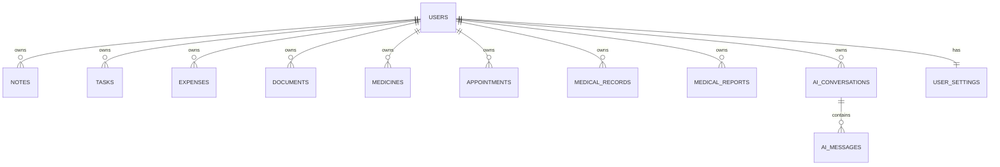

# OneNest AI Database Documentation

This document describes the current database model implemented in `backend/OneNest.Infrastructure` and `backend/OneNest.Domain`.

> Scope rule: only entities, relationships, indexes, and migrations that currently exist in code are documented.

## Stack

- **Database provider:** PostgreSQL
- **ORM:** Entity Framework Core
- **DbContext:** `OneNestDbContext`
- **Migrations folder:** `backend/OneNest.Infrastructure/Migrations`

## Schema Overview

`OneNestDbContext` currently contains these sets:

- `Users`
- `UserSettings`
- `Notes`
- `Tasks`
- `Expenses`
- `Documents`
- `Medicines`
- `Appointments`
- `MedicalRecords`
- `MedicalReports`
- `AIConversations`
- `AIMessages`

## Entity Catalog

| Entity | Purpose | User-owned |
|---|---|---|
| `User` | Auth identity and profile | N/A (root user record) |
| `UserSettings` | Per-user settings/preferences | Yes (`UserId`) |
| `Note` | Personal notes | Yes |
| `TaskItem` | Personal tasks | Yes |
| `Expense` | Income/expense transactions | Yes |
| `Document` | Uploaded document metadata | Yes |
| `Medicine` | Medicine tracking | Yes |
| `Appointment` | Healthcare appointments | Yes |
| `MedicalRecord` | Current medical profile | Yes |
| `MedicalReport` | Uploaded medical report metadata | Yes |
| `AIConversation` | AI chat conversations | Yes |
| `AIMessage` | Messages for a conversation | Indirect via conversation |

## Core Columns by Entity

## `Users`

- `Id` (uuid, PK)
- `FullName` (text)
- `Email` (text, unique)
- `PasswordHash` (text)
- `CreatedAt` (timestamp with time zone)
- `UpdatedAt` (timestamp with time zone, nullable)
- `LastLoginAt` (timestamp with time zone, nullable)

## `UserSettings`

- `Id` (uuid, PK)
- `UserId` (uuid, unique index)
- Theme/UI settings: `Theme`, `CompactSidebar`, `EnableAnimations`
- AI settings: `EnableWorkspaceContext`, `ContextDepth`, `DefaultConversationMode`, `ResponseStyle`, `EnableSmartSuggestions`
- Notification settings: `EnableAppointmentReminders`, `EnableMedicineReminders`, `EnableTaskReminders`, `EnableWeeklySummary`, `EnableDesktopNotifications`
- Documents/health defaults: `AutoDeleteTrashDays`, `DefaultHeightUnit`, `DefaultWeightUnit`, `ReminderLeadTimeHours`
- `CreatedAt`, `UpdatedAt`

Defaults configured:

- `AutoDeleteTrashDays = 30`
- `ReminderLeadTimeHours = 24`

## Notes/Tasks/Expenses

Shared pattern:

- `Id`, `UserId`, `CreatedAt`, `UpdatedAt`
- Domain-specific fields (`Title`, `Description`, `Amount`, etc.)

Notable field definitions:

- `Expense.Amount` precision: **18,2**
- `TaskItem.Priority` enum-backed integer
- `TaskItem.CompletedAt` nullable

## Documents/MedicalReports

Shared file metadata pattern:

- `OriginalFileName`
- `StoredFileName`
- `ContentType`
- `FileSize`

These entities store metadata in DB; file binary content is stored via file storage service.

## Health Entities

- `Medicine`: schedule flags (`Morning`, `Afternoon`, `Night`), dosage/timing, active flag
- `Appointment`: doctor/hospital/date/time/status
- `MedicalRecord`: one current profile per saved record operation (service-level behavior)
- `MedicalReport`: report classification, doctor/hospital/date, file metadata

## AI Entities

### `AIConversation`

- `Id` (PK)
- `UserId`
- `Title`
- `CreatedAt`, `UpdatedAt`, `LastMessageAt`
- `IsArchived`, `IsDeleted`

### `AIMessage`

- `Id` (PK)
- `ConversationId` (FK -> `AIConversations.Id`)
- `Role` (enum-backed int)
- `Content`
- `CreatedAt`
- `TokenCount` (nullable)
- `IsError`

## Relationships

The explicit EF relationship configured in `OnModelCreating`:

- `AIConversation (1) -> (many) AIMessage`
  - FK: `AIMessage.ConversationId`
  - Delete behavior: **Cascade**

Other ownership relations are currently represented by `UserId` columns and enforced in repository/service logic.

## ER Overview (Current)

## Indexes

Configured indexes from DbContext/migrations:

| Table | Index | Unique |
|---|---|---|
| `Users` | `Email` | Yes |
| `UserSettings` | `UserId` | Yes |
| `AIConversations` | `UserId` | No |
| `AIConversations` | `CreatedAt` | No |
| `AIConversations` | `UpdatedAt` | No |
| `AIConversations` | `LastMessageAt` | No |
| `AIMessages` | `ConversationId` | No |
| `AIMessages` | `CreatedAt` | No |

## Migration Timeline

## `20260803123221_AddAuthAndUserOwnership`

- Added `Users` table
- Added `UserId` to `Tasks` and `Notes`
- Added unique index `IX_Users_Email`

## `20260804074022_AddAIConversationHistory`

- Added `AIConversations`
- Added `AIMessages`
- Added AI indexes (`UserId`, timestamps, FK index)
- Added cascade delete from conversations to messages

## `20260804210920_AddUserSettings`

- Added `UserSettings` table
- Added unique index `IX_UserSettings_UserId`
- Added default values:
  - `AutoDeleteTrashDays = 30`
  - `ReminderLeadTimeHours = 24`

## `20260805111607_AddUserLastLoginAt`

- Added nullable `LastLoginAt` to `Users`

## Data Ownership and Isolation

- Nearly all feature records contain `UserId` for per-account isolation.
- API controllers are authorized for protected modules.
- Current-user context is resolved from JWT (`NameIdentifier` claim) by `CurrentUserService` and used in repositories/services.

## Planned Improvements

> Planned improvements are recommendations; they are not fully implemented yet.

- Add explicit foreign-key constraints from user-owned tables to `Users` for stronger referential integrity.
- Add composite indexes for common filtered queries (for example `UserId + CreatedAt` on high-volume tables).
- Add soft-delete lifecycle columns where long-term audit history is required.
- Add migration-level checks/constraints for enum value safety and data quality rules.
- Add DB seed strategy for local development and onboarding.
