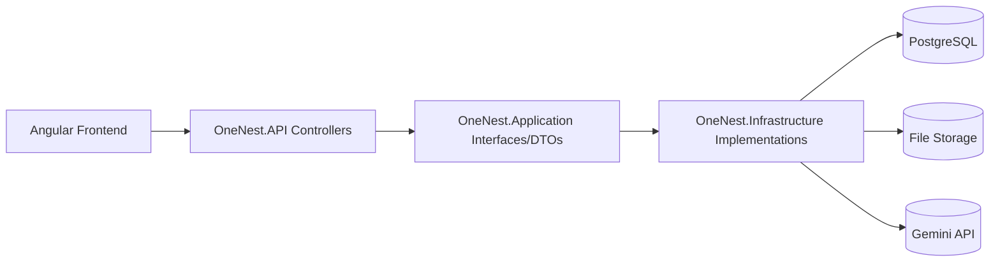
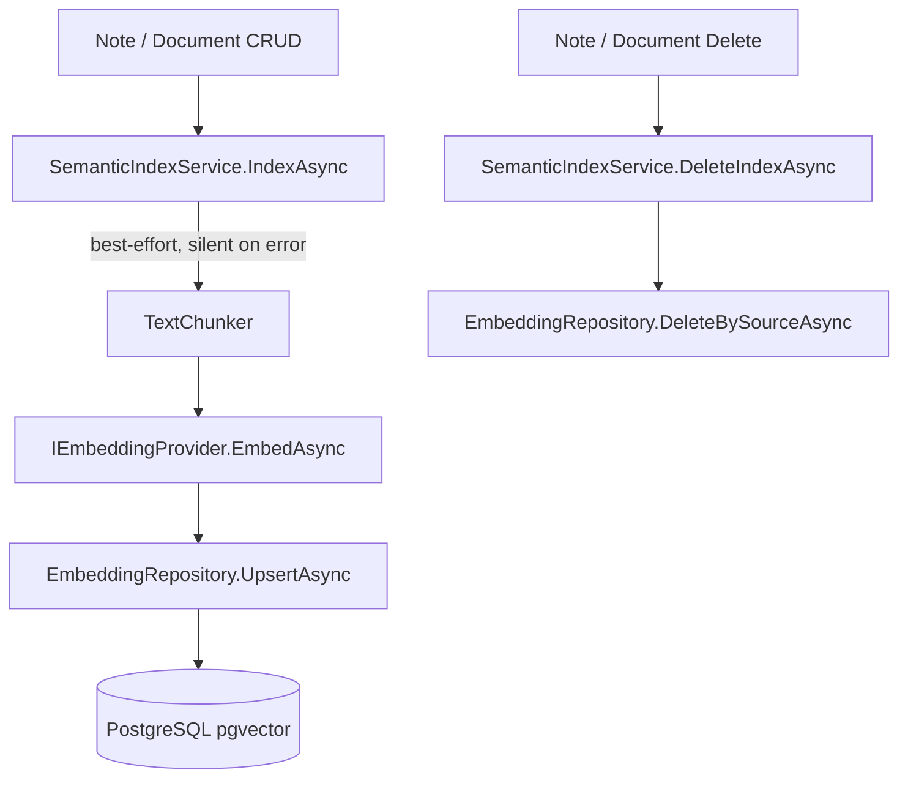
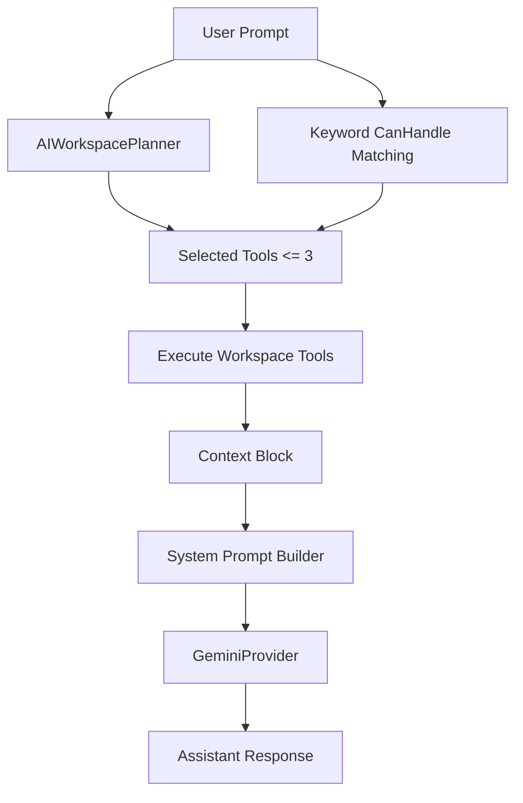

# OneNest AI Infrastructure & Architecture

This document explains the backend architecture currently implemented in OneNest AI.

## High-Level Architecture

OneNest follows a layered design aligned with Clean Architecture principles:

## Layer Responsibilities

## `OneNest.API`

- Hosts HTTP endpoints/controllers
- Configures middleware pipeline
- Configures auth, CORS, OpenAPI/Swagger
- Maps service exceptions to HTTP status codes

## `OneNest.Application`

- DTO contracts
- Service/repository/security/storage interfaces
- Application-level service contracts and exceptions

## `OneNest.Domain`

- Core entities (`User`, `TaskItem`, `Document`, `AIConversation`, etc.)
- Domain enums (`TaskPriority`, `ExpenseCategory`, etc.)

## `OneNest.Infrastructure`

- EF Core DbContext
- Repository implementations
- Service implementations
- Security implementations (`JwtTokenGenerator`, `CurrentUserService`)
- AI provider and workspace orchestration
- File storage implementation
- Dependency injection composition root

## Dependency Injection Composition

`AddInfrastructure(configuration)` wires:

- DbContext with Npgsql connection string
- Repositories + services for Notes/Tasks/Expenses/Documents/Health/Auth/Settings/AI
- `IFileStorageService` as singleton
- JWT/security helpers (`IJwtTokenGenerator`, `ICurrentUserService`)
- `IPasswordHasher<User>`
- AI modules:
  - `IAIProvider` -> `GeminiProvider` (HttpClient with `HttpClientHandler`, 30s timeout)
  - `IAIWorkspacePlanner`
  - `IAIWorkspaceOrchestrator`
  - workspace tools (`tasks`, `expenses`, `notes`, `documents`, `health`)
- Phase 8 — Semantic Search modules:
  - `IEmbeddingProvider` -> `GeminiEmbeddingProvider` (singleton, owns its own `HttpClient`)
  - `ITextChunker` -> `TextChunker` (singleton, stateless)
  - `IEmbeddingRepository` -> `EmbeddingRepository`
  - `ISemanticIndexService` -> `SemanticIndexService`
  - `ISemanticSearchService` -> `SemanticSearchService`
  - `IBackfillService` -> `BackfillService`

**Embedding provider selection** (`Embeddings:Provider` config key):

| Value | Provider | Dimensions | Notes |
|---|---|---|---|
| `Gemini` (default) | `GeminiEmbeddingProvider` | 768 | Hosted, requires `AI:ApiKey` |
| `Local` | `LocalEmbeddingProvider` | 384 | Offline ONNX (all-MiniLM-L6-v2), no API key |

## API Host Pipeline

Current pipeline in `Program.cs`:

1. `AddInfrastructure(...)`
2. Controllers + OpenAPI + Swagger configuration
3. JWT Bearer authentication
4. Authorization
5. CORS policy for Angular local dev origin `http://localhost:4200`
6. Middleware order:
   - `UseHttpsRedirection`
   - `UseCors`
   - `UseAuthentication`
   - `UseAuthorization`
   - `MapControllers`

Swagger security scheme includes Bearer token support.

## Authentication & Security Design

## JWT flow

- Token issued by `JwtTokenGenerator`.
- Claims include user id (`sub`, `nameidentifier`) and email.
- Token lifetime is based on `Jwt:ExpiryMinutes` config.
- API validates issuer/audience/lifetime/signature.

## Current user resolution

- `CurrentUserService` reads `ClaimTypes.NameIdentifier` from `HttpContext.User`.
- Throws `UnauthorizedAccessException` when no authenticated user is available.

## Password handling

- Uses ASP.NET Core `PasswordHasher<User>`.
- Auth service performs register/login/change-password/delete-account checks.

## Persistence: Repositories + Services

Pattern used consistently:

- Controllers depend on service interfaces.
- Services apply domain and business rules.
- Repositories isolate EF/database access.

This keeps API transport logic thin and business rules concentrated in services.

## File Storage Integration

- `FileStorageService` registered as singleton through `IFileStorageService`.
- Document and medical-report modules persist metadata in DB and files in storage.
- API supports single-file download/preview and bulk document ZIP download.

## AI Integration Design

## Chat Provider

- Active provider: **Gemini** (`GeminiProvider`)
- Endpoint: Google Generative Language API
- Model fallback when unset: `gemini-3.5-flash`
- Retry behavior:
  - Retries on 429/5xx/network timeout with backoff
- Error mapping:
  - Auth failure -> invalid operation message
  - Rate-limit -> invalid operation message consumed by API -> 429

## Embedding Provider (Phase 8)

`GeminiEmbeddingProvider` owns its own `HttpClient` (static singleton pattern) to avoid the DI typed-factory/singleton mismatch.

- **Endpoint:** `https://generativelanguage.googleapis.com/v1beta/models/gemini-embedding-001:embedContent`
- **Model:** `gemini-embedding-001`
- **Output dimensions:** 768 (configured via `Embeddings:Dimension`)
- **SSL handling in Development:** `HttpClientHandler.DangerousAcceptAnyServerCertificateValidator` to handle corporate SSL-inspection proxies (Zscaler). Production uses default `HttpClientHandler` with full certificate validation.
- **On any failure:** returns `null` — CRUD operations are never blocked by embedding errors.

## Text Chunker (Phase 8)

`TextChunker` splits extracted text into overlapping chunks for embedding:

| Config key | Default | Description |
|---|---|---|
| `TextChunker:ChunkSizeChars` | 1200 | Max characters per chunk |
| `TextChunker:ChunkOverlapChars` | 240 | Overlap between consecutive chunks |

## Semantic Indexing Design (Phase 8)

- `SemanticIndexService` wraps all exceptions in a bare `catch {}` — indexing failures are logged at Warning level but never propagate to the caller. This is intentional: CRUD must never fail due to embedding unavailability.
- `BackfillService` re-indexes all notes and documents for a given user. Safe to call multiple times (upsert semantics).
- `EmbeddingRepository` uses raw ADO.NET (`Database.GetDbConnection()`) for all pgvector operations since EF Core cannot generate `vector(N)` column DDL or map float arrays to it without additional packages.

## Conversation service

`AIConversationService` currently handles:

- Conversation CRUD-like operations (create, list, rename, archive, unarchive, soft-delete)
- Message persistence
- History truncation (`HistoryLimit = 20`)
- System prompt generation with:
  - user display context
  - response style preference
  - workspace context block
- Context depth behavior:
  - low depth compacts context
  - medium/high keep fuller context

## Workspace-aware AI orchestration

- Planner uses the AI provider to return strict JSON tool selections.
- Tool failures are isolated and do not block fallback AI response.
- Response metadata (`usedWorkspaceData`, `responseMode`, `workspaceToolsUsed`) is embedded and exposed.

## Exception-to-HTTP Mapping Patterns

- `AuthException`
  - register -> `409`
  - login -> `401`
  - change-password/delete-account -> `400`
- `InvalidOperationException`
  - many business-rule errors -> `400`
  - AI rate limit text -> `429`
- null/not-found outcomes -> `404` or `204` depending on operation semantics

## Clean Architecture Notes (Current State)

Implemented well:

- Dependency inversion via interfaces in Application layer
- API layer not directly coupled to EF DbContext
- Infrastructure concerns isolated in infrastructure project

Current pragmatic tradeoff:

- Some ownership constraints are enforced at service/repository logic level rather than full FK graph constraints.

## Planned Improvements

> Planned improvements are recommendations based on current implementation.

- Add centralized exception-handling middleware for consistent error envelope across all controllers.
- Add structured observability (correlation IDs, request logging, metrics) for production diagnostics.
- Add explicit authorization policies/roles if multi-role scenarios are introduced.
- Add resilience policies (circuit breaker, timeout policy) for external AI calls.
- Add background processing for heavyweight jobs (bulk exports/imports, async reports).
