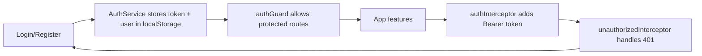

# OneNest AI UI Documentation (Angular)

This document explains the current Angular frontend structure and behavior.

## Frontend Stack

- **Framework:** Angular 22 (standalone components)
- **State style:** Angular signals + reactive forms
- **HTTP:** `HttpClient` with interceptors
- **Charts:** `chart.js`

## App Structure

```text
src/app
├─ app.routes.ts
├─ app.config.ts
├─ core/
│  ├─ auth.guard.ts
│  ├─ auth.interceptor.ts
│  └─ unauthorized.interceptor.ts
├─ layout/
│  ├─ layout.ts
│  ├─ layout.html
│  └─ layout.css
├─ features/
│  ├─ auth/ (login, register)
│  ├─ dashboard/
│  ├─ notes/
│  ├─ tasks/
│  ├─ expenses/
│  ├─ documents/
│  ├─ health/
│  ├─ ai-assistant/
│  ├─ settings/
│  └─ legal/ (privacy-policy, terms)
├─ services/
├─ models/
└─ shared/ (toast, confirm, spinner, paginator, chart)
```

## Navigation and Routing

Main route map:

- Public:
  - `/login`
  - `/register`
- Protected (behind `authGuard`):
  - `/dashboard`
  - `/notes`
  - `/tasks`
  - `/expenses`
  - `/documents`
  - `/health`
  - `/ai-assistant`
  - `/settings`
  - `/privacy-policy`
  - `/terms`

Fallback route redirects to root.

## Layout System

The root protected shell (`Layout`) provides:

- Left sidebar navigation
- User identity summary (name/email)
- Logout action with confirmation
- Main scrollable content area for feature pages
- Global `<app-confirm />` and `<app-toast />` mounts

## Authentication UX Flow



Behavior details:

- Token key: `onenest.token`
- User key: `onenest.user`
- On 401 while authenticated: auto logout and redirect to login.

## Design System & Styling Conventions

Global style tokens are defined in `src/styles.css`:

- Color tokens (`--color-primary`, `--color-danger`, etc.)
- Radius/shadow tokens
- Spacing scale
- Font base

Shared UI patterns used widely:

- `.page`
- `.card`
- `.btn` variants
- `.form-group`, `.row`
- `.actions`
- `.field-error`

Feature CSS files refine per-module layout while keeping global visual language.

## Responsiveness

Current app layout uses a fixed sidebar + scrollable content pattern (`height: 100dvh`).

- Desktop behavior is polished across core pages.
- Components use flexible blocks (`row`, `actions`, wrapped button groups).
- No separate mobile shell is currently defined in routes/layout.

## Feature Module Behavior

## Dashboard

- Aggregates data from Notes, Tasks, Expenses, Documents, and Health Summary services.
- Uses chart components for:
  - Expense category distribution
  - Monthly income vs expense
  - Health medicine timing distribution
  - Appointment timeline
- Uses explicit empty states (`No ... yet`) for missing data.

## Notes

- CRUD + pin toggle
- List-based note management

## Tasks

- CRUD + complete toggle
- Priority and due-date handling

## Expenses

- CRUD + summary analytics
- Category and transaction-type aware entries

## Documents

- Upload/update/delete
- Search, category filter, sorting, pagination
- Preview/download per file
- 25 MB client upload guard

## Health

Tabbed health workspace:

- Medicines
- Appointments
- Medical record
- Medical reports

Includes:

- Filtering/searching/pagination where applicable
- Report upload/preview/download
- Unit-aware medical record handling via settings (cm/ft, kg/lb)

## AI Assistant

Current UX includes:

- Conversation list with filter (`all|active|archived`) and search
- Create/rename/archive/unarchive/delete conversation
- Suggested prompts
- Workspace-context indicators on assistant responses
- Composer visibility tied to selected active conversation context
- Empty states:
  - no conversation selected
  - selected conversation with no messages

## Settings

Sections currently shown:

- Account
- AI Preferences
- Storage
- Measurements
- Security
- About

Key user-facing behaviors:

- AI Preferences UI exposes **Context Depth** and **Response Style** controls.
- Storage section aggregates usage across Documents + Health Reports under 150 MB display logic.
- Storage actions:
  - Download storage archive (ZIP)
  - Clear storage (confirmation + result toast)
- Security section:
  - Change password modal flow
  - Delete account flow (confirmation + password modal)
- About section links to:
  - Privacy Policy
  - Terms
  - GitHub repository

## Legal Pages

- `/privacy-policy`
- `/terms`

Both are integrated in-app pages with return link to settings.

## Service Layer Mapping (Frontend -> Backend)

| Frontend service | Backend API area |
|---|---|
| `AuthService` | `/api/auth/*` |
| `AiService` | `/api/ai/*` |
| `DocumentsService` | `/api/documents/*` |
| `HealthHubService` | `/api/medicines`, `/api/appointments`, `/api/medicalrecords`, `/api/medicalreports`, `/api/health-hub/summary` |
| `SettingsService` | `/api/settings` |
| `ExpensesService` | `/api/expenses` |
| `NotesService` | `/api/notes` |
| `TasksService` | `/api/tasks` |

## Planned Improvements

> Planned improvements are recommendations based on current UI implementation.

- Add first-class mobile navigation (collapsible sidebar/top-nav pattern).
- Add route-level code splitting for faster initial load.
- Add accessibility pass (keyboard flows, ARIA labels, contrast checks).
- Add richer error boundaries and retry UX for network failures.
- Add component-level unit tests and e2e coverage for critical flows (auth, storage, AI chat).
